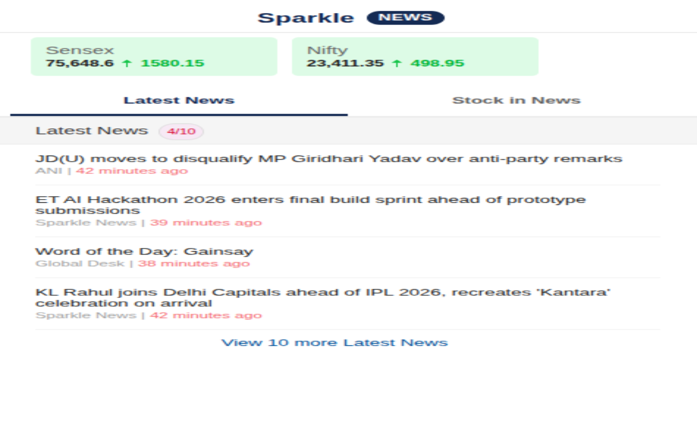
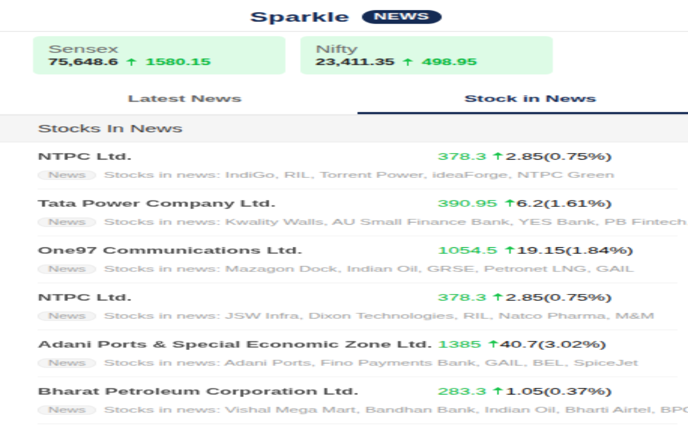
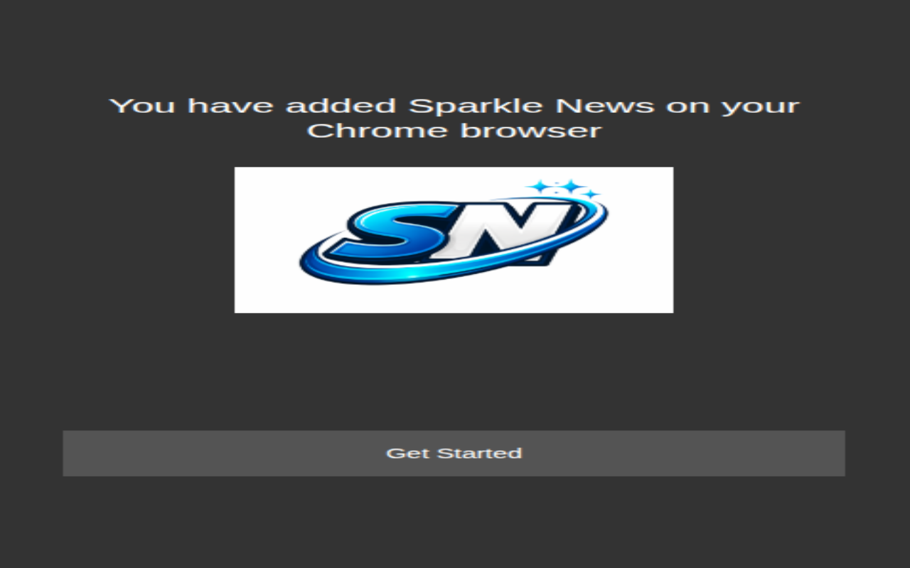

# Sparkle News

**Live headlines and stocks in one click** — a Chrome extension (Manifest V3) that opens a compact popup with **Latest News**, **Stocks in News**, and **Sensex / Nifty** at a glance. Data updates while you browse; the toolbar badge can show new-article activity until you open the popup.

<p align="center">
  
</p>

---

## Preview

<table>
  <tr>
    <td align="center"><b>Latest News</b></td>
    <td align="center"><b>Stock in News</b></td>
  </tr>
  <tr>
    <td></td>
    <td></td>
  </tr>
</table>

<p align="center">
  
</p>

---

## Features

|                    |                                                                            |
| ------------------ | -------------------------------------------------------------------------- |
| **Latest News**    | Scrollable feed with timestamps and quick links to full articles           |
| **Stocks in News** | Companies in the headlines with price move, % change, and related news     |
| **Markets strip**  | Sensex & Nifty snapshot in the popup header                                |
| **Fresh data**     | Popup refreshes on a timer; background uses alarms for badge-style updates |
| **Focused build**  | Minimal permissions — no portfolio / broker flows in this version          |

---

## Requirements

- **Google Chrome** (or another Chromium browser with **Manifest V3** support)
- Extension package: **`1.0.0/`** — version **1.0.0** (see `1.0.0/manifest.json`)

---

## Installation

### From source (developer)

1. Clone or download this repository.
2. Open Chrome → `chrome://extensions/`.
3. Enable **Developer mode**.
4. Click **Load unpacked** and choose the **`1.0.0`** folder (the folder that contains `manifest.json`).

### Chrome Web Store

Zip the **contents** of `1.0.0/` so **`manifest.json` is at the root** of the ZIP, then upload in the Developer Dashboard. A pre-built archive may exist at repo root as `1.0.0.zip` when you ship a release.

---

## Project layout

```text
SparkleNews/
├── 1.0.0/                 # Extension package (upload this folder or its zip)
│   ├── manifest.json
│   ├── html/                # Popup entry (starter → index)
│   ├── js/                  # Service worker, popup logic
│   ├── css/, img/, images/
│   └── ...
├── Images/                  # Screenshots & branding for README / store assets
│   ├── ss-1.png
│   ├── ss-2.png
│   ├── ss-3.png
│   └── logo.png
└── README.md
```

---

## Permissions (summary)

| Permission                             | Why                                                                                  |
| -------------------------------------- | ------------------------------------------------------------------------------------ |
| `storage`                              | Local state for badge / counters and lightweight UI cache                            |
| `alarms`                               | Scheduled background refresh for badge updates                                       |
| **Host access** (declared in manifest) | Read-only fetch of public news & market JSON from the listed Indiatimes / feed hosts |

No remote JavaScript or CSS is loaded from CDNs; libraries ship inside the package. Live content comes from **data** requests only.

---

## Privacy

- No account login required for core news features.
- Data is fetched from **public feeds** needed for the UI.
- **`chrome.storage.local`** holds only small extension state on the device (not sent to a third-party analytics backend by this README’s scope).

---

## License & disclaimer

News and market data are from third-party sources; trademarks belong to their owners. Use the extension in line with those sites’ terms and applicable laws.

---

<p align="center">
  <b>Sparkle News</b> · v1.0.0 · Chrome Extension
</p>
